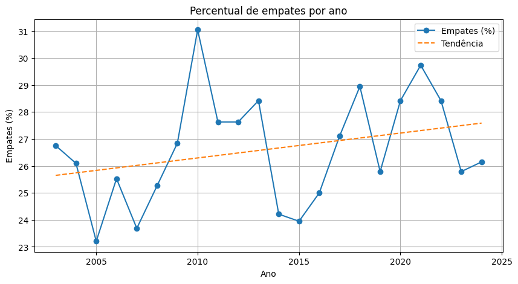
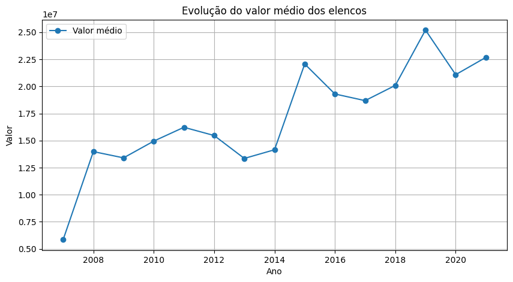
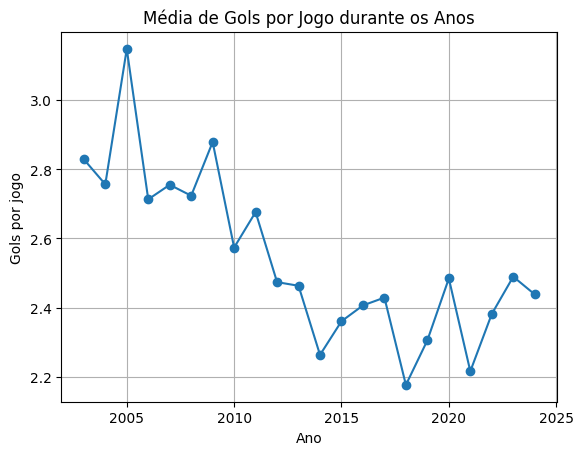

# Análise Exploratória de Dados – Brasileirão

Este projeto realiza uma **Análise Exploratória de Dados (EDA)** do Campeonato Brasileiro utilizando **Python, Pandas e Jupyter Notebook**, com o objetivo de identificar padrões, tendências e fatores que influenciam o desempenho das equipes.

---

---
## Objetivo

Explorar os dados do Brasileirão para responder perguntas como:

- Existe vantagem em jogar em casa?
- O primeiro tempo influencia o resultado final?
- O valor do elenco impacta o desempenho?
- Como o estilo de jogo evoluiu ao longo dos anos?

---

## Tecnologias Utilizadas

- Python
- Pandas
- NumPy
- Matplotlib
- Seaborn
- Jupyter Notebook

---

## 🔎 Etapas da Análise

### 1. Carregamento e limpeza dos dados
- Leitura do dataset (`CSV`)
- Tratamento de valores nulos e inconsistências

### 2. Feature Engineering
Criação de novas variáveis para análise:

- `resultado` → vencedor da partida  
- `total_gols` → intensidade ofensiva  
- `saldo_mandante` → força relativa  
- `vitoria_mandante` → variável binária  
- `pressao_mandante` → volume ofensivo  
- `ganhou_1t` → desempenho no primeiro tempo  

---

### 3. Análise Exploratória (EDA)

Foram analisados:

- Distribuição de resultados (mandante, visitante, empate)
- Média de gols por temporada
- Relação entre chutes e gols
- Impacto do primeiro tempo
- Influência do valor do elenco
- Público vs desempenho
- Evolução do estilo de jogo

---

## 📈 Principais Insights

### 🏠 Vantagem de jogar em casa
- ~49% das vitórias são de mandantes  
- Visitantes vencem apenas ~24%  

👉 O fator casa tem forte impacto nos resultados.

---

###  Importância do primeiro tempo
- Times que vencem o 1º tempo ganham ~79% dos jogos  

 A vantagem inicial é decisiva.

---

###  Impacto do valor de elenco
- Times mais valiosos: ~59% de vitórias  
- Times menos valiosos: ~43,7%  

 Existe forte correlação entre investimento e desempenho.

---

###  Equilíbrio do campeonato
- Média de gols entre 2.2 e 2.8  
- Alta incidência de empates e jogos equilibrados  

 O Brasileirão é altamente competitivo.

---

### 🏟️ Público e desempenho
- Jogos com maior público têm mais vitórias do mandante  

 Indício de influência da torcida (correlação).

---

### 📉 Evolução do estilo de jogo
- Início dos anos 2000: mais ofensivo  
- 2006–2018: foco defensivo  
- Pós-2019: retomada ofensiva  

---

## 📊 Visualizações

O projeto inclui diversos gráficos, como:

- Média de gols por ano  
- Distribuição de resultados  
- Evolução do público  
- Comparação mandante vs visitante  
- Percentual de empates e jogos sem gols  

---

##  Resultados

A análise demonstra como técnicas de EDA podem:

- Identificar padrões relevantes no futebol
- Apoiar análises esportivas
- Gerar insights estratégicos a partir de dados
